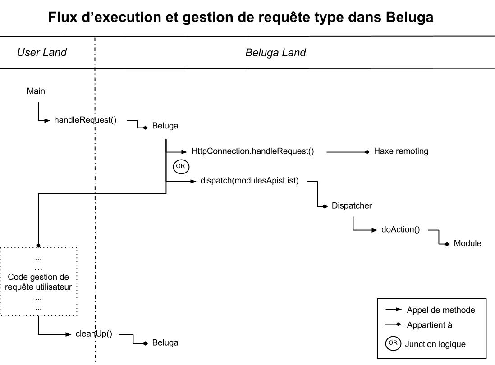

@(Beluga)[Documentation, Technical]

## Flux d'execution de Beluga

Le framework Beluga se veut aussi peut invasif et restrictif que possible pour le développeur. Aussi, le nombre d'appels nécessaire au bon fonctionnement de Beluga est au nombre de deux :
- Beluga.handleRequest()
- Beluga.cleanUP()

### Gestion de requête

La methode ``handleRequest`` doit être appelée en début d'exécution du serveur et laisse la main à Beluga pour lire la dernière requête reçu (URL + paramètres + headers). Si cette URL commence par ``http://nom.du.site/beluga``, Beluga garde la main et traite la requête comme lui appartenant.

Ensuite, avant de traiter la requête, Beluga vérifie que celle-ci n'a pas été lancée par un système interne à Haxe permettant le transfert d'instances de PHP vers JavaScript ("Haxe remoting"); auquel cas il laisse à Haxe le soin de gérer la requête.
Le cas échéant, le framework fait appel au dispatcher pour rediriger les paramètres de la requête vers la bonne méthode du bon module selon la convention ``URL/nom-du-module/nom-de-la-methode#parametres``. (cf Module Api TOBEFILED WITH HYPERLINK)

Beluga laisse alors de nouveau la main au contexte développeur. Ce dernier peut alors savoir si la requête reçue lui appartenait grâce à la valeur de retour de la methode ``handleRequest``.

### Quitter Beluga

La methode ``cleanUp`` permet à Beluga de reprendre une dernière fois la main avant la fin de l'execution du serveur. Celle-ci appelle trois methode :
- FlashData.updateTtl()
    - Cette methode met à jour les données de session dites "flash" (disponibles le temps d'une seule requête par défaut) (cf FlashData TOBEFILED WITH HYPERLINK)
- DataBase.close()
    - Cette methode ferme correctement le driver vers la base de donnée. (cd DataBase TOBEFILED WITH HYPERLINK)
- Session.close()
    - Essentielle sous ``Neko``, automatique sous ``Php``, cette methode permet la validation de la mise à jour des données de session. 
    
### Schema de flux d'exécution

